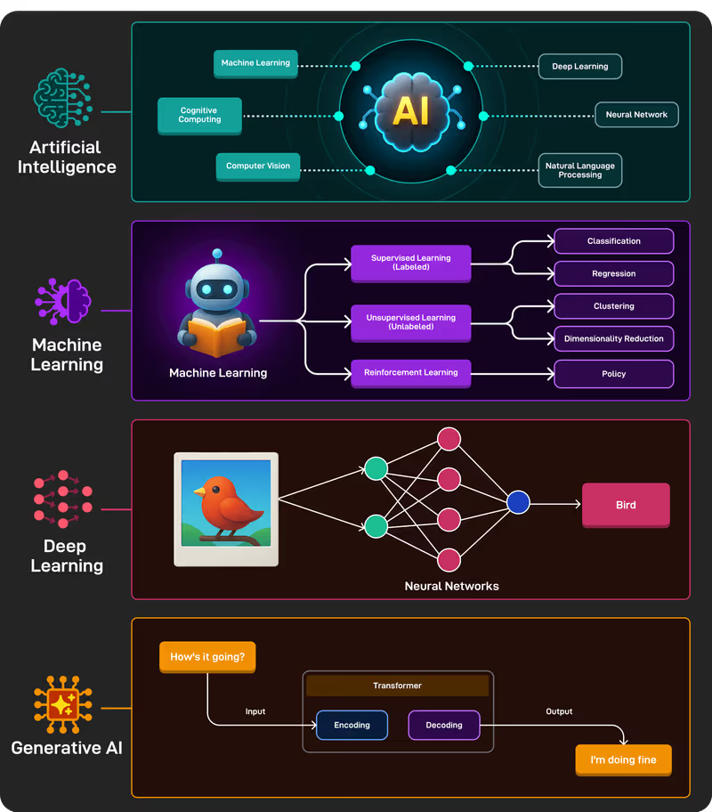
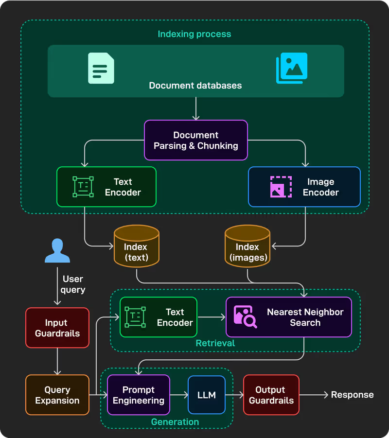
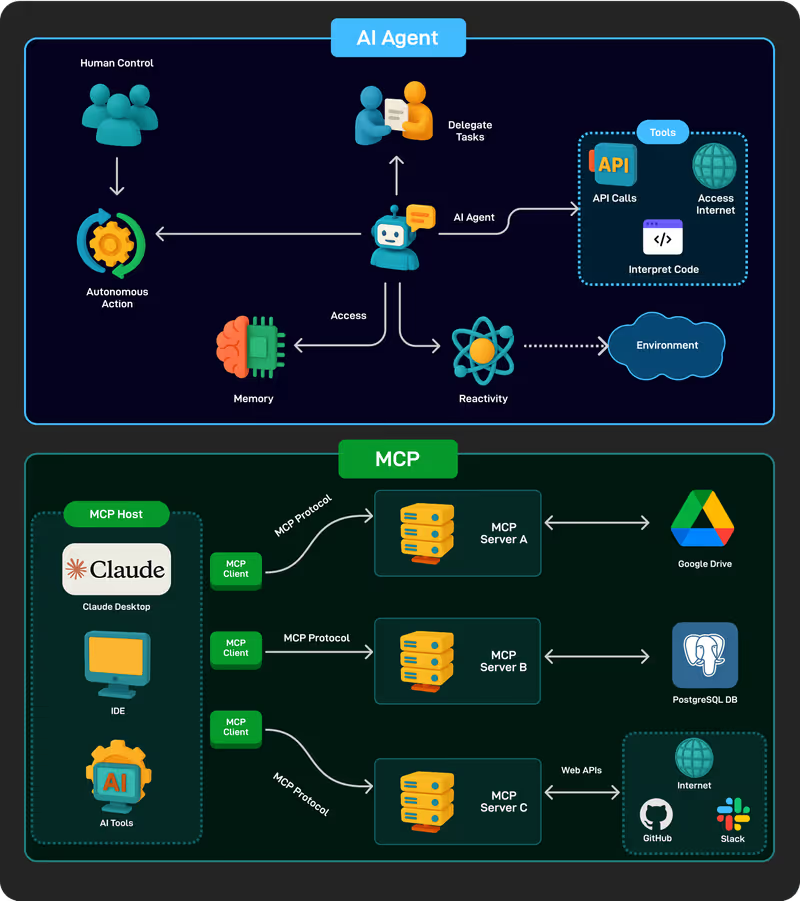

## [Project 1](./llm-palyground)

### Build an LLM Playground
- LLM Overview and Foundations
- Pre-Training
    - Data collection (manual crawling, Common Crawl)
    - Data cleaning (RefinedWeb, Dolma, FineWeb)
    - Tokenization (e.g., BPE)
    - Architecture (neural networks, - Transformers, GPT family, Llama family)
    - Text generation (greedy and beam search, top-k, top-p)
- Post-Training
    - SFT
   -  RL and RLHF (verifiable tasks, reward models, PPO, etc.)
- Evaluation
    - Traditional metrics
    - Task-specific benchmarks
    - Human evaluation and leaderboards
- Chatbots' Overall Design

## [Project 2](./chatbot)

### Build a Customer Support Chatbot using RAGs and Prompt Engineering

- Overview of Adaptation Techniques
- Finetuning
    - Parameter-efficient fine-tuning (PEFT)
    - Adapters and LoRA
- Prompt Engineering
    - Few-shot and zero-shot prompting
    - Chain-of-thought prompting
    - Role-specific and user-context prompting
- RAGs Overview
- Retrieval
    - Document parsing (rule-based, AI-based) and chunking strategies
    - Indexing (keyword, full-text, knowledge-based, vector-based, embedding models)
- Generation
    - Search methods (exact and approximate nearest neighbor)
    - Prompt engineering for RAGs
- RAFT: Training technique for RAGs
- Evaluation (context relevance, faithfulness, answer correctness)
- RAGs' Overall Design

## [Project 3](./ask-the-web)

### Build an "Ask-the-Web" Agent similar to Perplexity with Tool calling

- Agents Overview
    - Agents vs. agentic systems vs. LLMs
    - Agency levels (e.g., workflows, multi-step agents)
- Workflows
    - Prompt chaining
    - Routing
    - Parallelization (sectioning, voting)
    - Reflection
    - Orchestration-worker
- Tools
    - Tool calling
    - Tool formatting
    - Tool execution
    - MCP
- Multi-Step Agents
    - Planning autonomy
    - ReACT
    - Reflexion, ReWOO, etc.
    - Tree search for agents
- Multi-Agent Systems (challenges, use-cases, A2A protocol)
- Evaluation of agents

