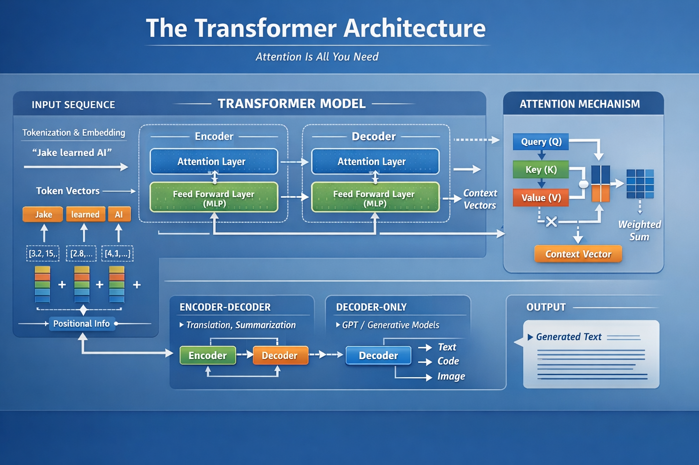

# Transformer Architecture

## 1. Goal of Machine Learning

Machine learning models learn a mapping from inputs to outputs.

Examples:

- House price prediction: features → price

- Spam detection: text sequence → spam/not spam

Neural networks achieve this by stacking layers that transform inputs into outputs through learned parameters. 

## 2. Problem with Sequential Data

Tasks like language require understanding context between words.

Earlier models:

- RNNs (Recurrent Neural Networks)

- LSTMs (Long Short-Term Memory networks)

Problems with these models:

1. Sequential processing

    - Tokens processed one-by-one

    - Training is slow

2. Long-term dependency problem

    - Early information gets lost in long sequences 

## 3. Transformer Breakthrough (2017)

The paper *“Attention Is All You Need”* introduced the Transformer, which solved these issues.

Key innovation:

**Attention Mechanism**

Allows all tokens in a sequence to interact with each other directly.

Result:

    - Captures context efficiently

    - Enables parallel processing

    - Handles long-range dependencies 

## 4. Transformer Architecture

A transformer consists of stacked layers built from two main components:

1. Attention Layer

    - Tokens communicate with other tokens

    - Determines which words are important

2. Feed-Forward (MLP) Layer

    - Each token independently refines its representation

Additional elements:

- Residual connections

- Layer normalization
(these stabilize training) 

## 5. Input Processing Pipeline
Step 1 – Tokenization

Text is split into tokens.

Example:

    "Jake learned AI"
    → ["Jake", "learned", "AI"]

Step 2 – Embedding

Tokens are converted into numerical vectors capturing meaning.

Step 3 – Positional Encoding

Transformers don’t understand order by default, so position information is added to embeddings.

Example:

    "Jake learned AI" ≠ "AI learned Jake"

## 6. Attention Mechanism (Core Idea)

Each token generates three vectors:

| Vector |	Purpose |
|-- | -- |
| Query (Q)	| What information am I looking for? |
| Key (K)	| What information do I contain? |
| Value (V)	| The actual information to share |

Attention Calculation

1. Compare Query with Keys (dot product)

2. Apply Softmax → attention weights

3. Compute weighted sum of Values

This produces a context-aware representation for each token. 

## 7. Parallel Computation

Instead of processing tokens sequentially, transformers:

- Stack Q, K, V into matrices

- Perform attention via matrix operations

Benefits:

- Highly parallelizable

- Efficient on GPUs 

## 8. Training Behavior

At the start:

- Parameters are random

- Attention is meaningless

During training:

- Model learns patterns like:

    - verbs attending to subjects

    - pronouns attending to nouns 

## 9. Variants of Attention

Different attention types modify the mechanism:

- Masked Attention – used in text generation

- Multi-Head Attention – multiple attention perspectives

 - Cross Attention – connects encoder and decoder

These improve modeling flexibility. 

## 10. Transformer Use Cases

Transformers work wherever elements in a sequence must interact.

Applications:

- Machine translation

- Text generation

- Summarization

- Sentiment analysis

- Code generation

- Image processing

- Audio processing 

## 11. Transformer Model Types
Encoder–Decoder

Used for:

    - Translation

    - Summarization

Decoder-Only

Used for:

    - Generative models like GPT 

#
## [Practice](Transformer_Attention.ipynb)

## Key Takeaway

A Transformer is a neural network where tokens communicate with each other using attention.

This communication mechanism is what makes modern AI systems powerful.

